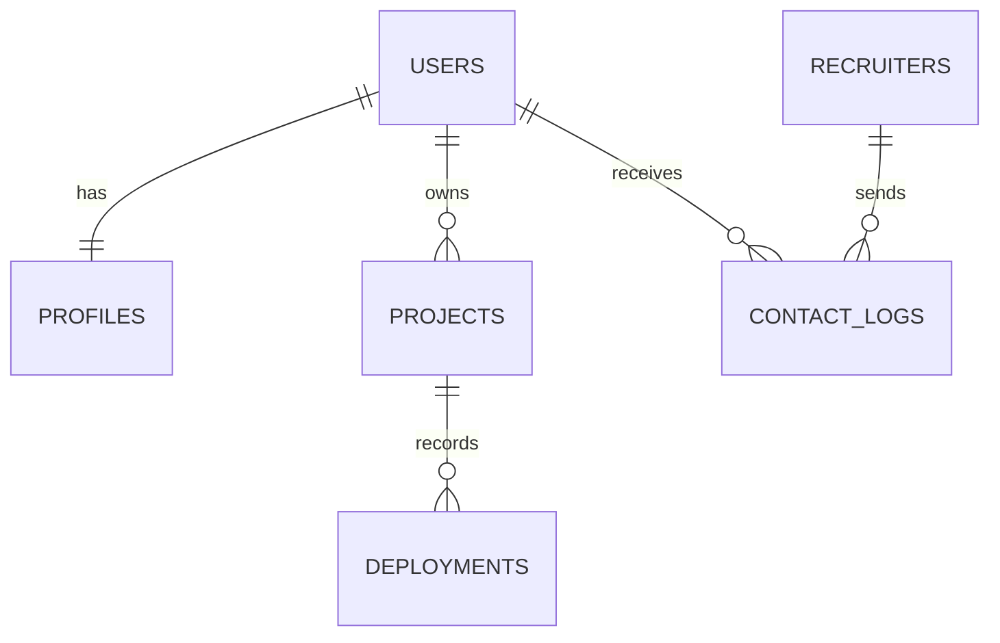

# Diccionario de Datos del Sistema

## Proyecto: ULEAM Academic Hosting
**Versión:** 1.0  
**Fecha:** 14 de Junio de 2026  
**Autor:** Choez David  
**Institución:** Universidad Laica Eloy Alfaro de Manabí (ULEAM)  

---

## 1. Introducción
Este documento contiene la descripción detallada de la estructura de base de datos relacional del sistema **ULEAM Academic Hosting**, implementada sobre **PostgreSQL 16**. Detalla las tablas, campos, tipos de datos, llaves primarias, llaves foráneas y restricciones de integridad que aseguran la consistencia de la información.

---

## 2. Esquema Relacional de Tablas

---

## 3. Detalle de Tablas

### 3.1 Tabla: `users`
Almacena los usuarios registrados en el sistema, diferenciando entre estudiantes y administradores. Los estudiantes deben registrarse usando correo institucional.

| Nombre de Campo | Tipo de Dato | Nulidad | Claves | Descripción |
| :--- | :--- | :--- | :--- | :--- |
| `id` | `UUID` | NOT NULL | PK | Identificador único del usuario (Generado por UUID v4). |
| `name` | `VARCHAR(255)` | NOT NULL | | Nombre y apellido completo del usuario. |
| `email` | `VARCHAR(255)` | NOT NULL | UNIQUE | Correo electrónico. Estudiantes: `@uleam.edu.ec`. |
| `email_verified_at`| `TIMESTAMP` | NULL | | Fecha y hora en que se verificó el correo electrónico. |
| `password` | `VARCHAR(255)` | NOT NULL | | Contraseña encriptada utilizando algoritmos seguros (bcrypt). |
| `role` | `VARCHAR(20)` | NOT NULL | | Rol del usuario. Valores permitidos: `student`, `admin`. |
| `remember_token` | `VARCHAR(100)` | NULL | | Token para recordar la sesión activa. |
| `created_at` | `TIMESTAMP` | NOT NULL | | Fecha y hora de creación del registro. |
| `updated_at` | `TIMESTAMP` | NOT NULL | | Fecha y hora de la última actualización del registro. |

---

### 3.2 Tabla: `profiles`
Contiene la información profesional y académica detallada de cada estudiante, utilizada para la autogeneración de la hoja de vida (CV).

| Nombre de Campo | Tipo de Dato | Nulidad | Claves | Descripción |
| :--- | :--- | :--- | :--- | :--- |
| `id` | `UUID` | NOT NULL | PK | Identificador único del perfil. |
| `user_id` | `UUID` | NOT NULL | FK | Llave foránea que referencia a `users.id` (Relación 1:1, ON DELETE CASCADE). |
| `bio` | `TEXT` | NULL | | Descripción corta o resumen profesional del estudiante. |
| `phone` | `VARCHAR(20)` | NULL | | Número de teléfono de contacto. |
| `github_username` | `VARCHAR(100)` | NULL | | Nombre de usuario de GitHub para vinculación. |
| `linkedin_url` | `VARCHAR(255)` | NULL | | Enlace al perfil profesional de LinkedIn. |
| `skills` | `JSONB` | NULL | | Arreglo de habilidades técnicas del estudiante (ej: React, Laravel, PHP). |
| `education` | `JSONB` | NULL | | Historial académico del estudiante (fechas, títulos, etc.). |
| `cv_pdf_path` | `VARCHAR(255)` | NULL | | Ruta del archivo PDF de la hoja de vida en Cloudflare R2. |
| `created_at` | `TIMESTAMP` | NOT NULL | | Fecha y hora de creación del registro. |
| `updated_at` | `TIMESTAMP` | NOT NULL | | Fecha y hora de la última actualización del registro. |

---

### 3.3 Tabla: `projects`
Almacena los metadatos de los proyectos que el estudiante ha seleccionado desde su GitHub para desplegar en el hosting.

| Nombre de Campo | Tipo de Dato | Nulidad | Claves | Descripción |
| :--- | :--- | :--- | :--- | :--- |
| `id` | `UUID` | NOT NULL | PK | Identificador único del proyecto. |
| `user_id` | `UUID` | NOT NULL | FK | Llave foránea que referencia a `users.id` (Relación 1:N, ON DELETE CASCADE). |
| `name` | `VARCHAR(100)` | NOT NULL | | Nombre comercial o descriptivo del proyecto. |
| `subdomain` | `VARCHAR(63)` | NOT NULL | UNIQUE | Subdominio dinámico asignado (ej: `mi-proyecto`). |
| `github_repo_url` | `VARCHAR(255)` | NOT NULL | | URL del repositorio público en GitHub. |
| `branch` | `VARCHAR(50)` | NOT NULL | | Rama del repositorio para el despliegue (defecto: `main`). |
| `language` | `VARCHAR(20)` | NULL | | Lenguaje detectado del proyecto (`nodejs`, `php`, `python`). |
| `status` | `VARCHAR(20)` | NOT NULL | | Estado actual del contenedor: `stopped`, `running`, `sleeping`, `building`. |
| `container_id` | `VARCHAR(128)` | NULL | | ID del contenedor Docker asignado en el daemon local. |
| `port` | `INTEGER` | NULL | | Puerto interno del contenedor expuesto al proxy Traefik. |
| `last_visited_at` | `TIMESTAMP` | NULL | | Fecha y hora del último tráfico HTTP registrado (usado por auto-sleep). |
| `created_at` | `TIMESTAMP` | NOT NULL | | Fecha y hora de creación del registro. |
| `updated_at` | `TIMESTAMP` | NOT NULL | | Fecha y hora de la última actualización del registro. |

---

### 3.4 Tabla: `deployments`
Registra el historial de compilaciones y despliegues ejecutados para cada proyecto, permitiendo la auditoría y depuración.

| Nombre de Campo | Tipo de Dato | Nulidad | Claves | Descripción |
| :--- | :--- | :--- | :--- | :--- |
| `id` | `UUID` | NOT NULL | PK | Identificador único del deployment. |
| `project_id` | `UUID` | NOT NULL | FK | Llave foránea que referencia a `projects.id` (Relación 1:N, ON DELETE CASCADE). |
| `status` | `VARCHAR(20)` | NOT NULL | | Estado del despliegue: `queued`, `building`, `success`, `failed`. |
| `build_log` | `TEXT` | NULL | | Logs completos generados durante la compilación del código. |
| `duration_seconds`| `INTEGER` | NULL | | Tiempo de ejecución de la compilación en segundos. |
| `created_at` | `TIMESTAMP` | NOT NULL | | Fecha y hora de inicio del despliegue. |
| `updated_at` | `TIMESTAMP` | NOT NULL | | Fecha y hora del fin del despliegue. |

---

### 3.5 Tabla: `recruiters`
Almacena la información de contacto e identificación de los reclutadores externos interesados en evaluar estudiantes.

| Nombre de Campo | Tipo de Dato | Nulidad | Claves | Descripción |
| :--- | :--- | :--- | :--- | :--- |
| `id` | `UUID` | NOT NULL | PK | Identificador único del reclutador. |
| `name` | `VARCHAR(255)` | NOT NULL | | Nombre y apellido del reclutador. |
| `email` | `VARCHAR(255)` | NOT NULL | UNIQUE | Correo corporativo del reclutador. |
| `company` | `VARCHAR(100)` | NOT NULL | | Nombre de la empresa u organización a la que representa. |
| `position` | `VARCHAR(100)` | NULL | | Cargo o puesto del reclutador dentro de la empresa. |
| `password` | `VARCHAR(255)` | NOT NULL | | Contraseña encriptada para el inicio de sesión. |
| `verified` | `BOOLEAN` | NOT NULL | | Indica si el perfil y correo del reclutador fueron validados. |
| `created_at` | `TIMESTAMP` | NOT NULL | | Fecha y hora de creación de la cuenta. |
| `updated_at` | `TIMESTAMP` | NOT NULL | | Fecha y hora de la última actualización de la cuenta. |

---

### 3.6 Tabla: `contact_logs`
Registra los mensajes de contacto enviados por los reclutadores hacia los estudiantes, con fines de control de spam y auditoría de empleabilidad.

| Nombre de Campo | Tipo de Dato | Nulidad | Claves | Descripción |
| :--- | :--- | :--- | :--- | :--- |
| `id` | `UUID` | NOT NULL | PK | Identificador único del contacto. |
| `recruiter_id` | `UUID` | NOT NULL | FK | Llave foránea que referencia a `recruiters.id` (Relación 1:N). |
| `student_id` | `UUID` | NOT NULL | FK | Llave foránea que referencia a `users.id` (Relación 1:N). |
| `message` | `TEXT` | NOT NULL | | Mensaje redactado por el reclutador (ej: propuesta, consulta técnica). |
| `created_at` | `TIMESTAMP` | NOT NULL | | Fecha y hora de envío del mensaje. |
