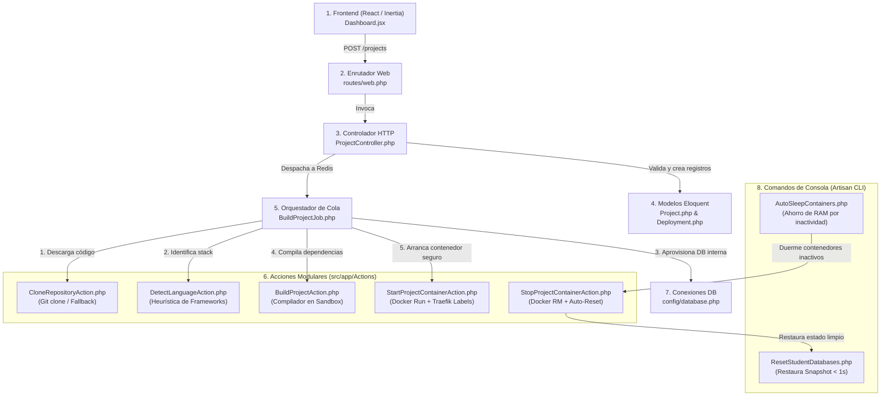

# Arquitectura de Archivos del Módulo de Despliegue

**Documento:** Mapa Detallado de Archivos, Métodos y Responsabilidades del Pipeline de Despliegue  
**Proyecto:** ULEAM Academic Hosting (PaaS)  
**Autor:** David Choez  
**Institución:** Universidad Laica Eloy Alfaro de Manabí (ULEAM)  

---

## 1. Visión General: El Ecosistema de Despliegue

El despliegue de un proyecto dentro de la plataforma **ULEAM Academic Hosting** no depende de un solo archivo monolítico, sino de una **arquitectura en capas modular desacoplada**. Sigue los principios de responsabilidad única (*Single Responsibility Principle - SRP*) y procesamiento asíncrono basado en colas (*Queue-Worker Architecture*).

### Mapa de Interacción entre Archivos



---

## 2. Inventario Detallado de Archivos Involucrados

A continuación se detalla cada uno de los archivos del repositorio que participan directa o indirectamente en el ciclo de vida del despliegue, indicando su rol, métodos clave y números de línea exactos.

---

### Capa 1: Frontend e Interfaz de Usuario

#### 1. [`src/resources/js/Pages/Dashboard.jsx`](file:///run/media/davidchoez/DATA/ULEAM_Academic/src/resources/js/Pages/Dashboard.jsx)
* **¿Qué hace en el despliegue?:**  
  Es la interfaz visual donde el estudiante interactúa para desplegar su aplicación. Controla el modal de creación de proyectos, gestiona la validación visual en tiempo real (evitando nombres inválidos o caracteres no permitidos en el subdominio), permite subir carpetas por Drag & Drop o ingresar URLs de GitHub, y realiza el seguimiento del estado del despliegue mediante peticiones periódicas (*polling*) para mostrar los logs de compilación.
* **Ubicación en el código:**
  * **Líneas 140 - 260:** Formulario React de configuración del proyecto (campos `name`, `subdomain`, `db_driver`, `github_repo_url`, `branch`, `folder_files`, `deployment_mode`).
  * **Líneas 310 - 365:** Función de envío `handleSubmit`:
    ```jsx
    router.post(route('projects.store'), formData, {
        forceFormData: true,
        onSuccess: () => { ... },
        onError: (errors) => { ... }
    });
    ```
  * **Líneas 420 - 510:** Componente de terminal interactiva que consume el endpoint `/projects/{id}/logs` para mostrar la salida de consola en vivo con estilos oscuros tipo terminal de servidor.

---

### Capa 2: Enrutamiento HTTP y Seguridad

#### 2. [`src/routes/web.php`](file:///run/media/davidchoez/DATA/ULEAM_Academic/src/routes/web.php)
* **¿Qué hace en el despliegue?:**  
  Define los puntos de entrada HTTP protegidos por los middlewares de autenticación de Laravel (`auth`, `verified`), conectando las solicitudes web con sus controladores respectivos.
* **Ubicación en el código:**
  * **Línea 23:** `Route::post('/projects', [ProjectController::class, 'store'])->name('projects.store');` $\rightarrow$ Punto de entrada para crear y desplegar un proyecto desde cero.
  * **Línea 25:** `Route::post('/projects/{project}/rebuild', [ProjectController::class, 'rebuild'])->name('projects.rebuild');` $\rightarrow$ Dispara la recompilación del proyecto tras cambios en el repositorio.
  * **Líneas 30 - 32:**  
    * `Route::post('/projects/{project}/start', [ContainerController::class, 'start']);` (Arranque manual).
    * `Route::post('/projects/{project}/stop', [ContainerController::class, 'stop']);` (Apagado manual).
    * `Route::get('/projects/{project}/logs', [ContainerController::class, 'logs']);` (Streaming de logs).

---

### Capa 3: Controladores Web y Orquestación de Solicitudes

#### 3. [`src/app/Http/Controllers/ProjectController.php`](file:///run/media/davidchoez/DATA/ULEAM_Academic/src/app/Http/Controllers/ProjectController.php)
* **¿Qué hace en el despliegue?:**  
  Es la puerta de enlace lógica del sistema. Valida las políticas de negocio (máximo 3 proyectos por alumno, unicidad del subdominio), procesa la subida de archivos ZIP/carpetas, registra las entidades en la base de datos y despacha el Job asíncrono para no bloquear la respuesta HTTP del navegador.
* **Ubicación en el código:**
  * **Líneas 72 - 120 (Método `store`):**
    * Verifica que el usuario no exceda su cuota máxima de proyectos (Línea 84).
    * Aplica validación estricta de regex para URLs públicas de GitHub: `regex:/^https:\/\/github\.com\/[a-zA-Z0-9_-]+\/[a-zA-Z0-9_.-]+$/i` (Línea 126).
  * **Líneas 160 - 210:** Creación del registro `Project` con estado inicial `pending` y creación de la entidad `Deployment`.
  * **Líneas 215 - 225:** Despacho asíncrono del pipeline:
    ```php
    BuildProjectJob::dispatch($deployment);
    ```
  * **Líneas 330 - 380 (Método `rebuild`):** Resetea el estado a `building` y despacha un nuevo `BuildProjectJob` para actualizar el contenedor existente.
  * **Líneas 390 - 450 (Método `destroy`):** Elimina contenedores de Docker, destruye las bases de datos de estudiantes asociadas y borra los archivos del disco para evitar fugas de almacenamiento.

#### 4. [`src/app/Http/Controllers/ContainerController.php`](file:///run/media/davidchoez/DATA/ULEAM_Academic/src/app/Http/Controllers/ContainerController.php)
* **¿Qué hace en el despliegue?:**  
  Permite al estudiante y al sistema encender, pausar o consultar la salud del contenedor una vez desplegado.
* **Ubicación en el código:**
  * **Líneas 19 - 49 (Método `start`):** Llama a `StartProjectContainerAction::execute()` para encender un contenedor apagado o dormido, actualizando su estado a `running`.
  * **Líneas 54 - 80 (Método `stop`):** Llama a `StopProjectContainerAction::execute()` para detener el contenedor y liberar memoria RAM.
  * **Líneas 85 - 118 (Método `logs`):** Combina el log histórico de compilación de la tabla `deployments` con la salida en vivo de `docker logs --tail 200 project-{id}` y lo retorna en formato JSON.

---

### Capa 4: Modelos de Dominio y Persistencia (Eloquent)

#### 5. [`src/app/Models/Project.php`](file:///run/media/davidchoez/DATA/ULEAM_Academic/src/app/Models/Project.php)
* **¿Qué hace en el despliegue?:**  
  Representa la entidad central de la aplicación del estudiante. Almacena las variables de estado (`pending`, `building`, `running`, `stopped`, `failed`, `sleeping`), la URL de GitHub, el subdominio asignado, las credenciales de base de datos aprovisionadas (`db_name`, `db_user`, `db_password`, `db_driver`), el ID del contenedor Docker y las instrucciones de prueba para evaluadores (`demo_instructions`).
* **Ubicación en el código:**
  * **Líneas 15 - 35:** Definición de `$fillable` y relaciones `user()` y `deployments()`.
  * **Líneas 40 - 55:** Relación `backendProject()` que permite enlazar proyectos frontend estáticos (React/Vue) con sus APIs backend correspondientes.

#### 6. [`src/app/Models/Deployment.php`](file:///run/media/davidchoez/DATA/ULEAM_Academic/src/app/Models/Deployment.php)
* **¿Qué hace en el despliegue?:**  
  Mantiene un registro de auditoría de cada intento de despliegue o recompilación. Almacena la duración en segundos, el estado final del build y el log completo de consola (`build_log`).
* **Ubicación en el código:**
  * **Líneas 12 - 25:** Atributos masivos (`project_id`, `status`, `build_log`, `commit_hash`, `duration_seconds`) y relación inversa `belongsTo(Project::class)`.

---

### Capa 5: Orquestador Central del Pipeline (El "Cerebro")

#### 7. [`src/app/Jobs/BuildProjectJob.php`](file:///run/media/davidchoez/DATA/ULEAM_Academic/src/app/Jobs/BuildProjectJob.php)
* **¿Qué hace en el despliegue?:**  
  Es el componente más importante del sistema (1,374 líneas). Se ejecuta en un proceso en segundo plano administrado por el worker de Redis (`php artisan queue:work`) con un límite de tiempo de 15 minutos (`$timeout = 900`). Coordina secuencialmente cada una de las 7 fases del despliegue:
* **Ubicación en el código:**
  * **Líneas 44 - 72 (Método `handle`):** Inyección de dependencias de acciones y preparación del log inicial.
  * **Líneas 74 - 120 (Fase 1 - Adquisición de Código):** Extrae archivos ZIP si se subieron localmente o delega a `CloneRepositoryAction`.
  * **Líneas 125 - 175 (Fase 2 - Detección de Lenguaje):** Invoca `DetectLanguageAction` para identificar si el proyecto es Node.js, PHP/Laravel, Python, Java, .NET o Dockerfile.
  * **Líneas 467 - 665 (Fase 2.5 - Aprovisionamiento de Base de Datos `provisionDatabase`):**
    * Ejecuta la validación temprana de integridad: si el código requiere BD pero no tiene `.sql` ni migraciones, lanza excepción HTTP 422 (Líneas 476 - 554).
    * Genera credenciales aleatorias seguras (Líneas 556 - 572).
    * Ejecuta sentencias DDL en MySQL, PostgreSQL o MongoDB central (Líneas 573 - 658).
  * **Líneas 1243 - 1334 (Fase 2.5 - Sincronización `.env` `syncProjectEnvironmentVariables`):** Inyecta automáticamente variables (`DB_HOST`, `DB_DATABASE`, `DATABASE_URL`, `MONGODB_URI`, etc.) en la raíz y subcarpetas (`/backend`, `/api`, `/server`).
  * **Líneas 180 - 230 (Fase 3 - Compilación en Sandbox):** Invoca `BuildProjectAction` para ejecutar `composer install`, `npm install && npm run build`, o `pip install` dentro de contenedores efímeros.
  * **Líneas 670 - 737 (Fase 3.3 - Importación SQL `importSqlFiles`):** Importa scripts `.sql` usando contenedores de cliente Docker descartables (`mysql:8.0` o `postgres:15-alpine`).
  * **Líneas 745 - 830 (Fase 3.5 - Migraciones Automáticas `runDatabaseMigrations`):** Ejecuta migraciones de frameworks (`php artisan migrate --force`, `python manage.py migrate`).
  * **Líneas 835 - 995 (Fase 3.6 - Silent Auto-Installation & Credenciales Universales):** Detecta asistentes de instalación web (ej. Crater, WordPress), ejecuta silenciosamente la inicialización y genera el usuario de pruebas (`admin@...` / `password`) para el reclutador.
  * **Líneas 235 - 270 (Fase 4 - Arranque Final):** Invoca `StartProjectContainerAction` para levantar el contenedor definitivo con Traefik y cuotas de hardware.
  * **Líneas 1340 - 1372 (Fase 5 - Snapshot Inicial `generateInitialDatabaseSnapshot`):** Genera `.initial_db_snapshot.sql` con `mysqldump` o `pg_dump` para permitir reseteos en menos de 1 segundo.

---

### Capa 6: Acciones Modulares de Infraestructura (Patrón Action)

#### 8. [`src/app/Actions/Github/CloneRepositoryAction.php`](file:///run/media/davidchoez/DATA/ULEAM_Academic/src/app/Actions/Github/CloneRepositoryAction.php)
* **¿Qué hace en el despliegue?:**  
  Clona repositorios públicos de GitHub de forma limpia y eficiente.
* **Ubicación en el código:**
  * **Líneas 34 - 53:** Ejecuta `git clone --depth 1 -b {branch} {url} {destino}` (clonación superficial de 1 solo commit para ahorrar ancho de banda y tiempo).
  * **Líneas 57 - 83:** **Mecanismo de Auto-recuperación (Fallback):** Si el estudiante indicó una rama que no existe (ej. escribió `main` pero el repositorio usa `master`), la acción detecta el fallo, limpia la carpeta y reintenta automáticamente clonando la rama por defecto sin abortar el despliegue.

#### 9. [`src/app/Actions/Docker/DetectLanguageAction.php`](file:///run/media/davidchoez/DATA/ULEAM_Academic/src/app/Actions/Docker/DetectLanguageAction.php)
* **¿Qué hace en el despliegue?:**  
  Analiza la estructura del proyecto y deduce automáticamente el entorno de ejecución adecuado mediante heurística jerárquica.
* **Ubicación en el código:**
  * **Líneas 21 - 30:** Detecta si existe `Dockerfile` propio (soporte universal).
  * **Líneas 32 - 38:** Detecta PHP si existe `composer.json`, `artisan` o `index.php`.
  * **Líneas 40 - 49:** Detecta Python si existe `requirements.txt`, `manage.py` o `Pipfile`.
  * **Líneas 51 - 54:** Detecta Node.js si existe `package.json`.
  * **Líneas 56 - 63:** Detecta Java si existe `pom.xml`, `build.gradle` o `gradlew`.
  * **Líneas 65 - 75:** Detecta .NET si existen archivos `.csproj` o `.sln`.

#### 10. [`src/app/Actions/Docker/BuildProjectAction.php`](file:///run/media/davidchoez/DATA/ULEAM_Academic/src/app/Actions/Docker/BuildProjectAction.php)
* **¿Qué hace en el despliegue?:**  
  Encapsula la lógica de compilación de dependencias (1,027 líneas). Para no contaminar el servidor anfitrión, levanta contenedores de build efímeros que se destruyen al terminar (`--rm`).
* **Ubicación en el código:**
  * **Líneas 57 - 145 (`buildNodeJs`):** Monta el proyecto en un contenedor `node:18-alpine` y ejecuta `npm install` y `npm run build`. Si detecta que el código usa bases de datos pero olvidaron incluir el driver en `package.json`, instala automáticamente `mysql2` o `pg`.
  * **Líneas 150 - 280 (`buildPhp`):** Monta el proyecto en un contenedor `composer:2`, ejecuta `composer install --no-dev --optimize-autoloader`, genera la llave con `php artisan key:generate` y optimiza rutas y vistas.
  * **Líneas 285 - 360 (`buildPython`):** Monta un contenedor `python:3.11-slim`, crea un entorno virtual (`venv`) e instala las librerías con `pip install -r requirements.txt`.
  * **Líneas 365 - 450 (`buildJava` y `buildDotnet`):** Compila binarios empaquetados usando imágenes oficiales de Maven y .NET SDK.
  * **Líneas 455 - 510 (`buildDockerfile`):** Ejecuta `docker build -t project-{id} .` si el alumno incluyó su propio Dockerfile.

#### 11. [`src/app/Actions/Docker/StartProjectContainerAction.php`](file:///run/media/davidchoez/DATA/ULEAM_Academic/src/app/Actions/Docker/StartProjectContainerAction.php)
* **¿Qué hace en el despliegue?:**  
  Arranca el contenedor de ejecución definitivo, configurando aislamiento de seguridad, cuotas de hardware estrictas y etiquetas para el enrutador inverso Traefik.
* **Ubicación en el código:**
  * **Líneas 44 - 45:** Lee el runtime configurado (`runsc` para gVisor en producción o `runc` para desarrollo local).
  * **Líneas 52 - 62 (Comando `docker run`):**
    * `--memory 256m` $\rightarrow$ Límite estricto de memoria RAM por contenedor.
    * `--cpus 0.5` $\rightarrow$ Límite máximo de medio núcleo de procesador.
    * `--pids-limit 50` $\rightarrow$ Prevención contra ataques de bombas fork (*fork bombs*).
    * `--network uleam_academic_network` $\rightarrow$ Conexión a la red privada interna.
  * **Líneas 83 - 105 (Etiquetas dinámicas de Traefik):**
    * `traefik.enable=true`
    * `traefik.http.routers.{id}.rule=Host('{subdominio}.{dominio}')`
    * `traefik.http.routers.{id}.entrypoints=websecure`
    * `traefik.http.routers.{id}.tls.certresolver=myresolver`
    * Configura a Traefik para que emita y asigne certificados SSL automáticos de Let's Encrypt sin reiniciar el proxy.

#### 12. [`src/app/Actions/Docker/StopProjectContainerAction.php`](file:///run/media/davidchoez/DATA/ULEAM_Academic/src/app/Actions/Docker/StopProjectContainerAction.php)
* **¿Qué hace en el despliegue?:**  
  Detiene de manera forzada el contenedor (`docker rm -f project-{id}`) y dispara el restablecimiento de la base de datos a su estado original para no dejar basura en el servidor.
* **Ubicación en el código:**
  * **Líneas 24 - 28:** Ejecuta el comando de remoción forzada en Docker.
  * **Líneas 30 - 38:** Dispara `Artisan::call('projects:reset-databases', ['--project' => $project->id])` para restaurar el snapshot de fábrica.

---

### Capa 7: Automatización y Mantenimiento Autónomo (Artisan CLI)

#### 13. [`src/app/Console/Commands/ResetStudentDatabases.php`](file:///run/media/davidchoez/DATA/ULEAM_Academic/src/app/Console/Commands/ResetStudentDatabases.php)
* **¿Qué hace en el despliegue?:**  
  Es la herramienta que materializa la política de **demostración efímera sin mantenimiento**. Permite que un evaluador modifique datos durante una prueba y que el proyecto se restaure solo en menos de 1 segundo.
* **Ubicación en el código:**
  * **Líneas 30 - 68:** Comando `projects:reset-databases`. Puede ejecutarse para todos los proyectos o para uno solo mediante `--project={id}`.
  * **Líneas 70 - 120:** Destrucción y recreación limpia de las bases de datos en MySQL, PostgreSQL o MongoDB.
  * **Líneas 242 - 275:** Detección y restauración ultra-rápida del archivo `.initial_db_snapshot.sql` usando clientes Docker efímeros.

#### 14. [`src/app/Console/Commands/AutoSleepContainers.php`](file:///run/media/davidchoez/DATA/ULEAM_Academic/src/app/Console/Commands/AutoSleepContainers.php)
* **¿Qué hace en el despliegue?:**  
  Garantiza que el servidor universitario no colapse por falta de RAM aunque existan cientos de proyectos registrados.
* **Ubicación en el código:**
  * **Líneas 30 - 96:** Comando `projects:auto-sleep` (programado en crontab cada 5 minutos).
  * **Líneas 46 - 65:** Inspecciona el tráfico de red de cada contenedor (`Network IO - Rx bytes`) usando `docker stats`.
  * **Líneas 68 - 84:** Si un contenedor pasa 15 minutos sin recibir ninguna petición web, cambia su estado a `sleeping` y lo apaga mediante `StopProjectContainerAction`, liberando sus 256 MB de RAM de inmediato. Cuando un usuario vuelve a ingresar a su URL en la vitrina, el sistema lo enciende de nuevo en 3 segundos.

---

### Capa 8: Configuración e Infraestructura

#### 15. [`src/config/database.php`](file:///run/media/davidchoez/DATA/ULEAM_Academic/src/config/database.php)
* **¿Qué hace en el despliegue?:**  
  Define las conexiones internas que utiliza Laravel para interactuar con los motores de bases de datos centrales de los estudiantes.
* **Ubicación en el código:**
  * **Líneas 102 - 114:** Conexión `students_postgres` (apunta a `uleam_postgres_students:5432`).
  * **Líneas 116 - 126:** Conexión `students_mysql` (apunta a `uleam_mysql_students:3306`).

#### 16. [`src/docker/setup-gvisor.sh`](file:///run/media/davidchoez/DATA/ULEAM_Academic/src/docker/setup-gvisor.sh)
* **¿Qué hace en el despliegue?:**  
  Script de infraestructura que instala y registra el binario `runsc` (gVisor) en el daemon de Docker (`/etc/docker/daemon.json`) para que los contenedores de los estudiantes se ejecuten con kernel virtualizado en el servidor de producción.

---

## 3. Matriz Resumen de Archivos y Responsabilidades

| Capa | Archivo | Clase / Componente | Responsabilidad Clave |
| :--- | :--- | :--- | :--- |
| **Frontend** | [`Dashboard.jsx`](file:///run/media/davidchoez/DATA/ULEAM_Academic/src/resources/js/Pages/Dashboard.jsx) | `Dashboard` (React) | Formulario de entrada, validación en cliente y visor de logs en vivo. |
| **Rutas** | [`web.php`](file:///run/media/davidchoez/DATA/ULEAM_Academic/src/routes/web.php) | `RouteServiceProvider` | Declaración de endpoints `/projects` y control de accesos autenticados. |
| **Controlador** | [`ProjectController.php`](file:///run/media/davidchoez/DATA/ULEAM_Academic/src/app/Http/Controllers/ProjectController.php) | `ProjectController` | Validación de negocio, persistencia inicial y despacho del Job a Redis. |
| **Controlador** | [`ContainerController.php`](file:///run/media/davidchoez/DATA/ULEAM_Academic/src/app/Http/Controllers/ContainerController.php) | `ContainerController` | Manejo de estados (`start`, `stop`) y lectura de logs de Docker. |
| **Modelo** | [`Project.php`](file:///run/media/davidchoez/DATA/ULEAM_Academic/src/app/Models/Project.php) | `Project` (Model) | Entidad principal, estado del ciclo de vida y credenciales de BD. |
| **Modelo** | [`Deployment.php`](file:///run/media/davidchoez/DATA/ULEAM_Academic/src/app/Models/Deployment.php) | `Deployment` (Model) | Historial de auditoría, duración y registros de compilación. |
| **Orquestador** | [`BuildProjectJob.php`](file:///run/media/davidchoez/DATA/ULEAM_Academic/src/app/Jobs/BuildProjectJob.php) | `BuildProjectJob` (Job) | **Cerebro del Pipeline:** Ejecuta las 7 fases de despliegue en segundo plano. |
| **Acción** | [`CloneRepositoryAction.php`](file:///run/media/davidchoez/DATA/ULEAM_Academic/src/app/Actions/Github/CloneRepositoryAction.php) | `CloneRepositoryAction` | Descarga de repositorios Git con auto-recuperación de ramas. |
| **Acción** | [`DetectLanguageAction.php`](file:///run/media/davidchoez/DATA/ULEAM_Academic/src/app/Actions/Docker/DetectLanguageAction.php) | `DetectLanguageAction` | Detección heurística de tecnologías y runtimes soportados. |
| **Acción** | [`BuildProjectAction.php`](file:///run/media/davidchoez/DATA/ULEAM_Academic/src/app/Actions/Docker/BuildProjectAction.php) | `BuildProjectAction` | Compilación de dependencias en contenedores efímeros aislados. |
| **Acción** | [`StartProjectContainerAction.php`](file:///run/media/davidchoez/DATA/ULEAM_Academic/src/app/Actions/Docker/StartProjectContainerAction.php) | `StartProjectContainerAction` | Lanzamiento del contenedor con gVisor, cuotas de hardware y Traefik. |
| **Acción** | [`StopProjectContainerAction.php`](file:///run/media/davidchoez/DATA/ULEAM_Academic/src/app/Actions/Docker/StopProjectContainerAction.php) | `StopProjectContainerAction` | Detención forzada y reseteo automático de base de datos. |
| **Comando CLI**| [`ResetStudentDatabases.php`](file:///run/media/davidchoez/DATA/ULEAM_Academic/src/app/Console/Commands/ResetStudentDatabases.php) | `ResetStudentDatabases` | Restauración del estado de fábrica vía snapshot SQL en < 1s. |
| **Comando CLI**| [`AutoSleepContainers.php`](file:///run/media/davidchoez/DATA/ULEAM_Academic/src/app/Console/Commands/AutoSleepContainers.php) | `AutoSleepContainers` | Suspensión automática de contenedores inactivos tras 15 minutos. |
| **Configuración**| [`database.php`](file:///run/media/davidchoez/DATA/ULEAM_Academic/src/config/database.php) | `config/database` | Conexiones administrativas para MySQL y PostgreSQL de estudiantes. |
| **Seguridad** | [`setup-gvisor.sh`](file:///run/media/davidchoez/DATA/ULEAM_Academic/src/docker/setup-gvisor.sh) | Script Bash | Configuración de sandboxing de bajo nivel gVisor (`runsc`). |
